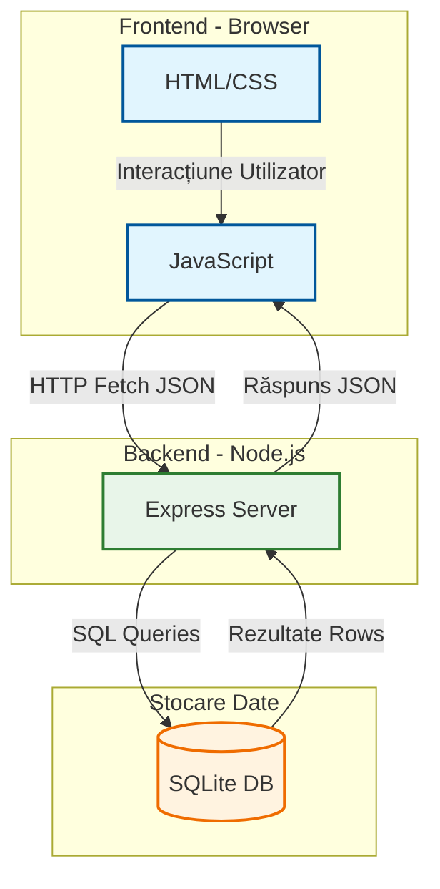

# SmartGrade - Sistem de Management al Notelor (Tip ZipGrade)

## 1. Descrierea Scopului
SmartGrade este o aplicație web modernă, optimizată pentru dispozitive mobile, destinată digitalizării procesului de examinare în mediul academic. Scopul principal este de a elimina corectarea manuală a testelor și de a oferi feedback instantaneu studenților, permițând profesorilor să creeze teste dinamice cu imagini și răspunsuri multiple.

## 2. Tehnologii Utilizate
* **Frontend:** HTML5, CSS3 (Responsive Flexbox/Grid), Vanilla JavaScript (ES6+).
* **Backend:** Node.js cu framework-ul Express.js.
* **Bază de Date:** SQLite (pentru persistența datelor: utilizatori, teste, întrebări, note).
* **Arhitectură:** REST API (Client-Server).

## 3. Instrucțiuni de Rulare
1.  Asigurați-vă că aveți Node.js instalat.
2.  Deschideți terminalul în folderul proiectului.
3.  Instalați dependențele: `npm install express sqlite3 cors body-parser`
4.  Porniți serverul: `node server.js`
5.  Accesați aplicația în browser la: `http://localhost:3000` (sau IP-ul local pentru mobil).

## 4. Funcționalități Implementate (Stadiu: >90%)
### Modul Profesor:
* Autentificare securizată.
* Creare teste complexe (titlu, întrebări nelimitate, încărcare imagini, variante multiple de răspuns).
* Vizualizare rezultate studenți în timp real.
* Review detaliat al lucrărilor (vizualizare răspunsuri corecte vs. greșite).

### Modul Student:
* Vizualizare teste disponibile (cu numele profesorului).
* Rezolvare teste online (interfață optimizată mobil).
* Primire notă instantaneu (calcul automat cu punctaj parțial).
* Istoric note și vizualizare detaliată a propriei lucrări (feedback vizual).

## 5. Arhitectura Aplicației

Frontend (Client): Este interfața vizuală creată cu HTML și CSS. Logica (script.js) preia datele introduse de utilizator și le trimite către server prin cereri asincrone (AJAX/Fetch).
Backend (Server): Construit pe Node.js cu Express. Acesta primește cererile, aplică logica de business (ex: calculează nota, verifică parola) și comunică cu baza de date.
Baza de Date: Folosim SQLite, o bază de date relațională stocată într-un singur fișier, pentru a salva permanent utilizatorii, testele și notele.
